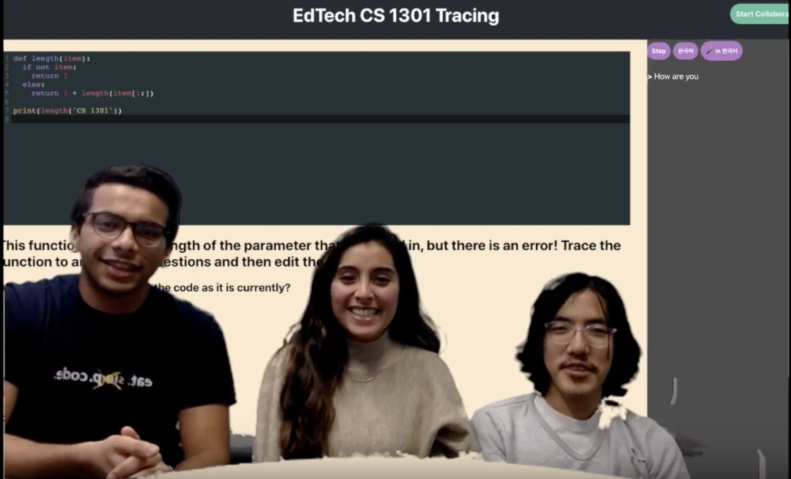
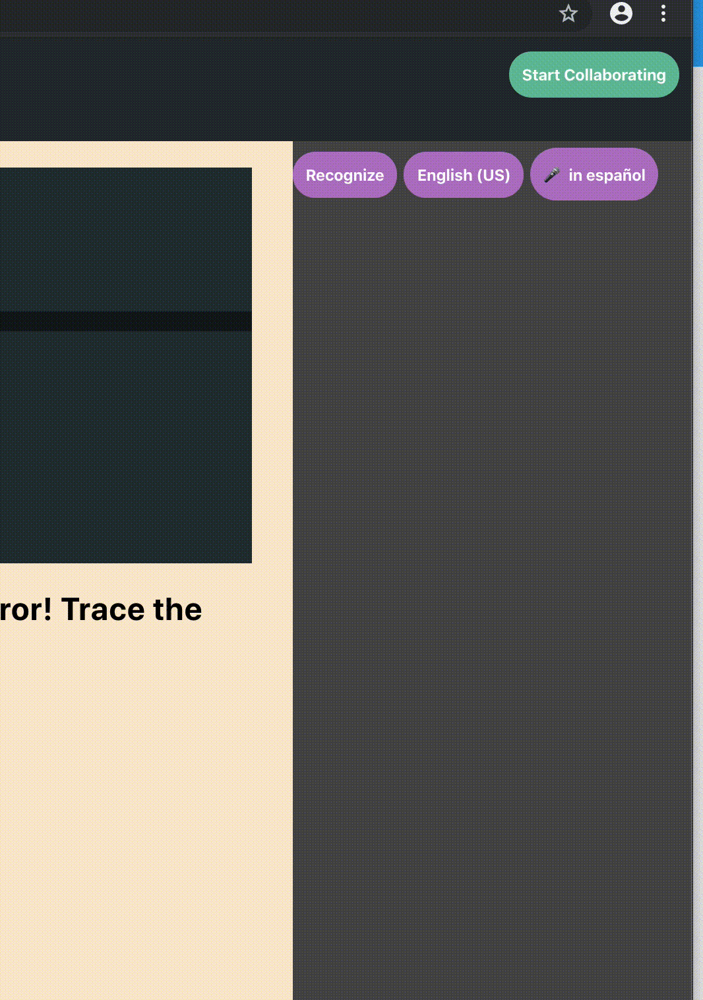
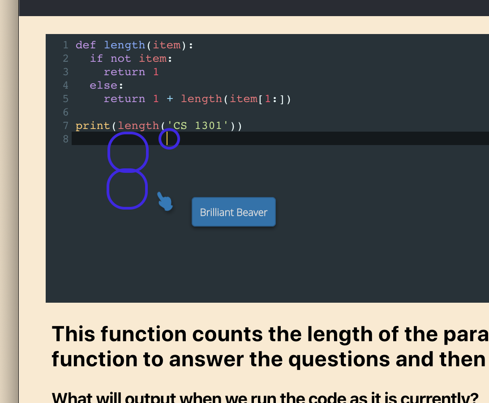
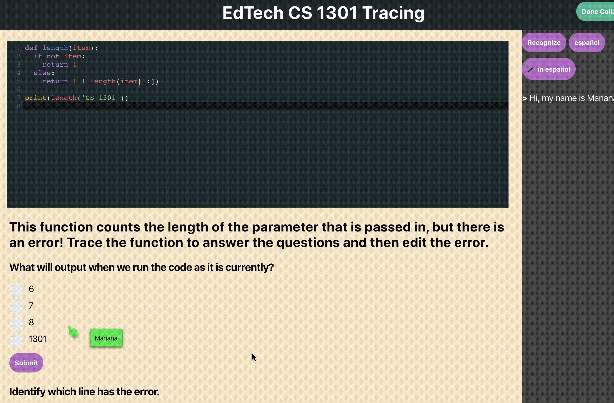
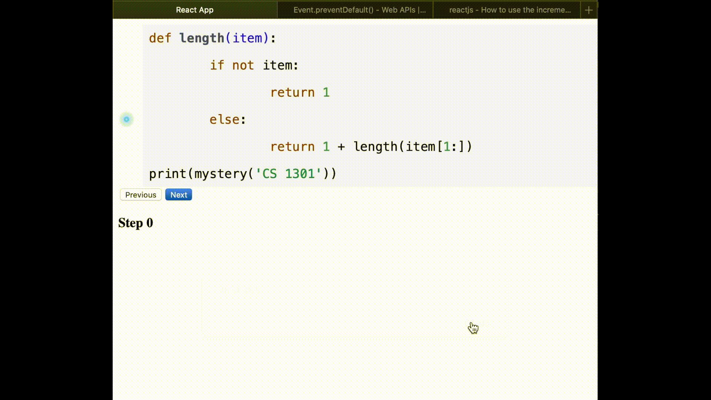
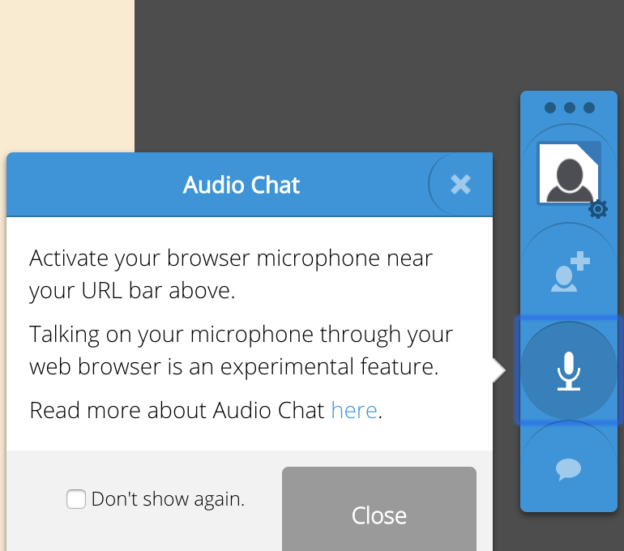
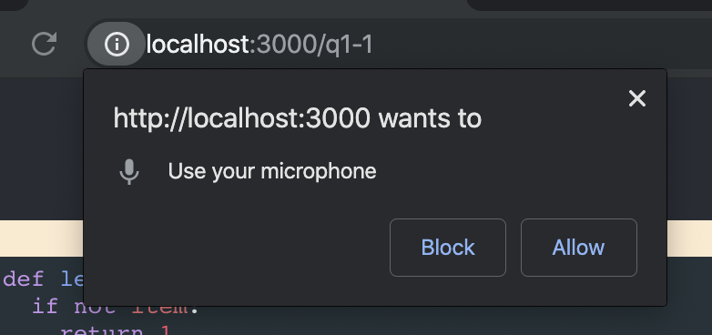

# PopLang
> *Utilize your entire language repertoire!*

### Check out the [video demo](https://youtu.be/KQ0D13wMkHY)!
[](https://youtu.be/KQ0D13wMkHY)


## Dependencies to run the app locally
- Node.js
    - Download for your system from [here](https://nodejs.org/en/download/)

## In order to run the frontend, run this command on your terminal

```
cd frontend && npm install && npm start
```

If the browser doesn't automatically open up after that, simply go to [localhost:3000/q1-1](http://localhost:3000/q1-1)


# Features Overview

## 1. Collaboration

Step 1. Hit `Start Collaborating`

Step 2. Collaborate!



## 2. Transcribe 

Following example (English <--> Spanish)


## 3. Editing Code together

> *Both Users can type on the code editor together in real-time.*



## 4. Answering questions together




## Future updates

> TLDR;

### Switching languages 
> Language switching isn't properly integrated yet. So to run the app with different languages, change the following code inside `Transcript.js`.
```Javascript

this.defaultTranslate = this.languageOptions.spanish_mx; // approx line 38
// modify above to test with korean like this
this.defaultTranslate = this.languageOptions.korean;

```

Other (*currently*) supported languages: 
- `german` 
- `arabic`
- `spanish_mx` (Spanish Mexico)
- `french_fr` (French France)
- `hindi`
- `korean`
- `russian` 
- `chinese_simp` (Chinese Simplified)

## Line by line tracing!

Idea: As soon as users connect and begin collaborating. They will trace the code line by line while talking to each other. This will make sure that students have closely looked at how the code will execute. It is similar to python turtle, as users have to become the dot and imagine which line the computer will run next.



### Rooms 

- We were in the process of using [Pusher Chatkit](https://pusher.com/chatkit) to implement rooms. 
    - A user would sign up and be added to a room of sorts. As soon as another person is available the two users would be paired up and would collaborate in this virtual "room". 

### The mic feature
> The essential tool to allow remote collaboration doesn't work.

- We used `Together.js` JavaScript library to implement the collaboration for this tool but the mic feature to allow audio call didn't work. 

- One note: Upon clicking on the mic, it does try to set up a call. This is evidenced by the prompt for mic permission. 






